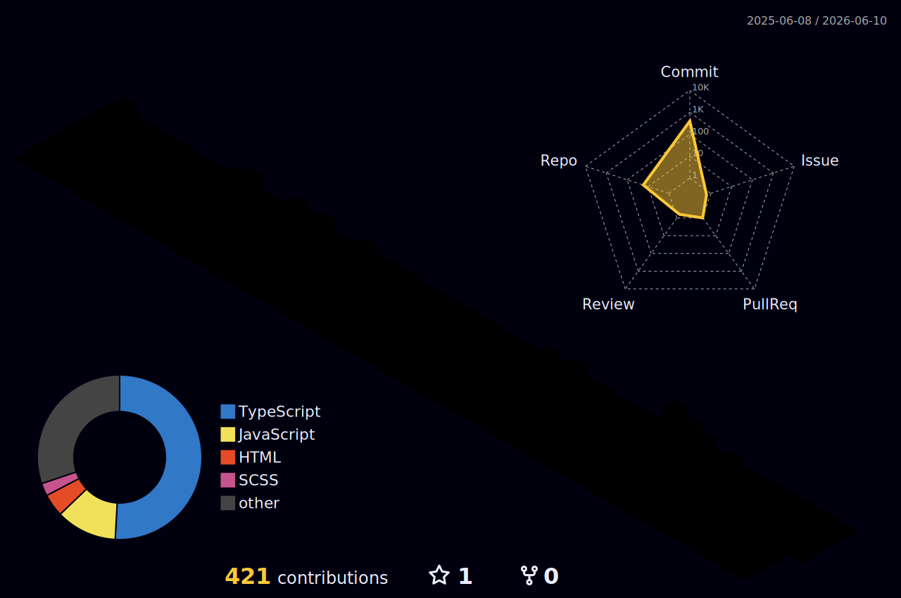

  

  

---

## 🌟 About Me

Hi! I'm **Anmol Chandrakar**, a passionate developer who loves turning ideas into code and exploring new technologies.
I enjoy building scalable applications, contributing to open source, and solving challenging problems.

- 🔥 **Aspiring Full-Stack Developer** | MERN + Next.js
- 🤝 **Open Source Enthusiast** | Always open to collaborate
- 🎯 **Tech Explorer** | Passionate about modern web & AI integration
- 📚 **Lifelong Learner** | Constantly leveling up
- 📍 Based in **India** 🇮🇳

---

## 🚀 What I'm Up To

- 🔭 Currently building **full-stack apps** with Next.js & Node.js
- 🌱 Learning **System Design** & **Advanced DSA**
- 👯 Looking to collaborate on **open-source projects**
- 💬 Ask me about **React, Node.js, MongoDB, or anything web-related**
- ⚡ Fun fact: I think in components 🧩

---

## 💻 Tech Stack & Tools

**Frontend**

  

**Backend & Databases**

  

**Tools & Others**

  

---

## 🛠️ Featured Projects

  
  

  
  

---

## 📊 GitHub Stats

<!-- Profile details: monthly commit bars + language breakdown -->

  

<!-- Stats: stars, commits, PRs, issues count | Productive time: when I'm most active -->

  
  

<!-- Streak: current & longest streak -->

  

---

## 📈 Contribution Activity

<!-- Daily contribution timeline over the past year -->

  

---

## 🌐 3D Contribution Graph

  

---

## 🐍 Contribution Snake

  

---

## 🏆 Achievements & Profiles

  
  
  

<!-- LeetCode stats: problems solved (Easy/Medium/Hard) + ranking -->

  

---

## 📫 Connect with Me

  
  
  
  
  

---

  

