  

---

## 🌟 About Me  

Hi! I'm **Anmol Chandrakar**, a passionate developer who loves turning ideas into code and exploring new technologies.  
I enjoy building scalable applications, contributing to open source, and solving challenging problems.

- 🔥 **Aspiring Full-Stack Developer**  
- 🤝 **Open Source Enthusiast** | Always open to collaborate  
- 🎯 **Tech Explorer** | Passionate about modern web & AI integration  
- 📚 **Lifelong Learner** | Constantly leveling up  

---

## 💻 My Journey So Far  

- 🚀 Exploring **GitHub & Open Source**  
- 👨‍💻 Building **real-world projects** with modern stacks  
- 🔍 Diving into **Full-Stack Development** (MERN + Next.js)  
- 🛠 Sharpening my **problem-solving & DSA skills**  

---

## 🎯 Goals  

✔ Contribute to impactful **open-source projects**  
✔ Build and deploy **production-ready applications**  
✔ Crack **coding interviews & placements**  
✔ Connect with **like-minded developers**  

---

## 🚀 Tech Stack & Tools  

  

---

## 📊 GitHub Stats  

  

  
  

  
  

  

---

## 🏆 Achievements & Profiles  

  
  
  

  

---

## 📫 Connect with Me  

  
  
  
  
  

---

  

---

  

⭐ **Let’s build something amazing together!** 🚀
